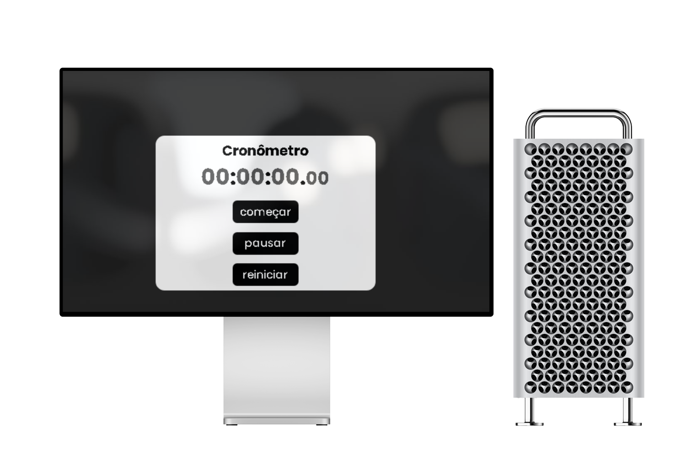

<h1 align="center">Timer</h1>

 
 

Olá tudo bem? Hoje estou apresentando um novo projeto, o Timer. Feito com as duas principais tecnologias utilizadas no Front End e com uma linguagem de programação, o Java Script.
  
 Esse projeto é muito simples, um cronômetro composto com milisegundos, segundos, minutos e horas. Feito para ajudar as pessoas a determinar um intervalo de tempo para algum acontecimento.

<h1>Tecnologias:</h1>

 -  

 - 

  - 

 
 

    

