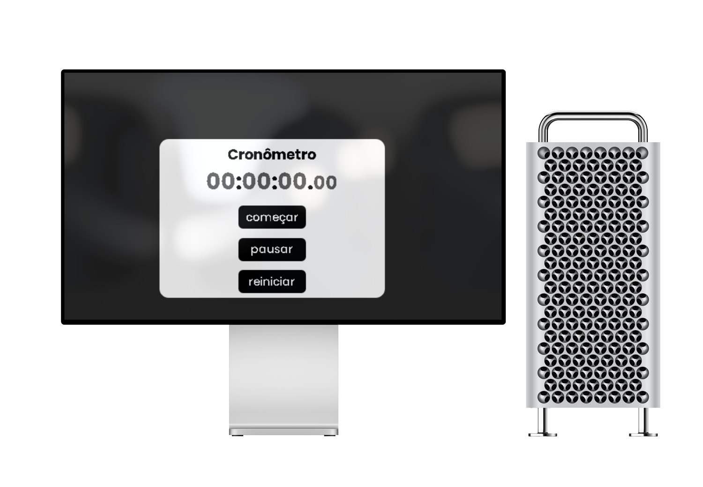

# Easy-Shopping

Este projeto é uma **dynamic page** de uma pagina de um croonometro, criado como parte da minha jornada de aprendizado em desenvolvimento
web. O objetivo era aumentar o conhecimento e a experiencia sobre HTML5, CSS e JavaScript.

## 📸 Page-Preview

  

## 👷🏻‍♀️ Tecnologias Utilizadas

- HTML
- CSS
- JavaScript

### 🚀Características

- Celular & Desktop Layouts
- Html Semantico

## 👩🏻‍💻 Autor

&nbsp;&nbsp;
&nbsp;&nbsp;

